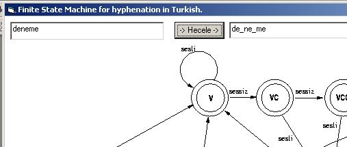



## Turkce Heceleme \- Hyphenation in Turkish

### Description

This is an implementation of a Finite State Machine for hyphenation in Turkish.
 
### More Info
 

             |
---                |---
**Submitted On**   |2003-07-08 09:42:04
**By**             |[suhan](https://github.com/Planet-Source-Code/PSCIndex/blob/master/ByAuthor/suhan.md)
**Level**          |Intermediate
**User Rating**    |5.0 (15 globes from 3 users)
**Compatibility**  |VB 4\.0 \(32\-bit\), VB 5\.0, VB 6\.0
**Category**       |[Miscellaneous](https://github.com/Planet-Source-Code/PSCIndex/blob/master/ByCategory/miscellaneous__1-1.md)
**World**          |[Visual Basic](https://github.com/Planet-Source-Code/PSCIndex/blob/master/ByWorld/visual-basic.md)
**Archive File**   |[Türkçe\_Hec161151782003\.zip](https://github.com/Planet-Source-Code/suhan-turkce-heceleme-hyphenation-in-turkish__1-46730/archive/master.zip)

